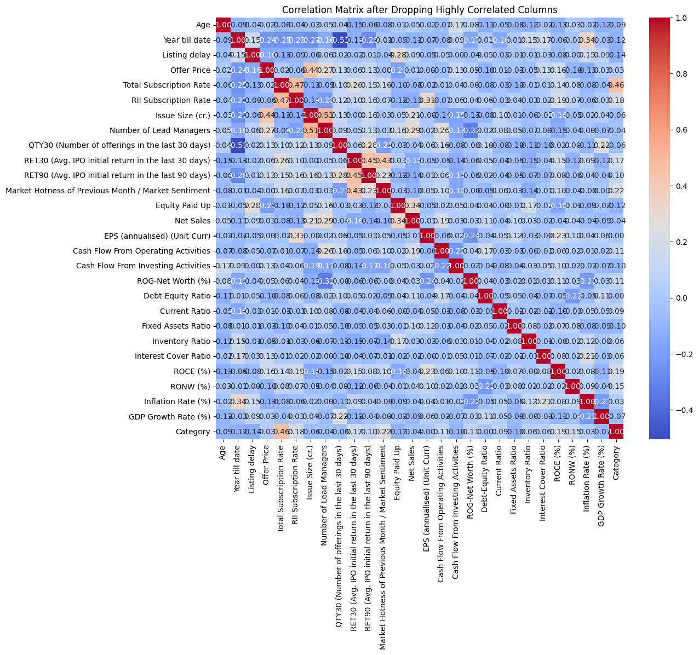
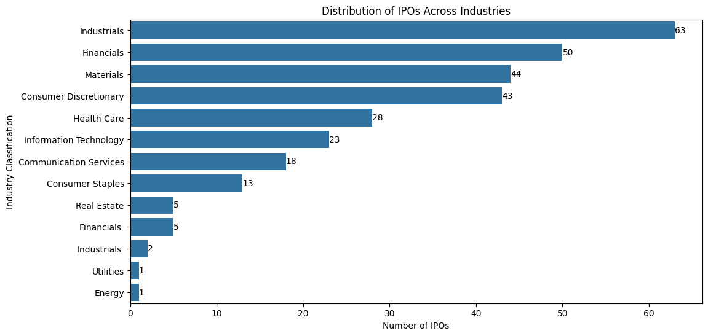

# IPO Price Pattern Analysis — Machine Learning on Indian Public Offerings

<div align="center">

[](https://opensource.org/licenses/Apache-2.0)


**Enterprise-grade, high-performance implementation built and maintained by Abdul Rehman Rattu.**

[Overview](#overview) • [Key Features](#key-features) • [Installation & Usage](#quickstart--usage) • [Author & Maintainer](#author--maintainer)

</div>

---

A structured machine learning study on Indian IPO data covering 296 listings across 11 industry sectors. The project applies regression and multi-class classification techniques to model two distinct outcomes: the initial underpricing percentage at listing, and the one-year post-listing return. Six classification algorithms and two regression models are evaluated and compared against a common feature set derived from company financials, market conditions, and offering characteristics.

---

## Problem Statement

IPO pricing is one of the most studied phenomena in financial economics. Two related questions drive this work:

1. **Regression** — Can financial and structural features of an IPO predict its magnitude of underpricing (difference between offer price and listing price) and its one-year return?
2. **Classification** — Can these same features reliably classify whether an IPO will underprice or generate positive one-year returns, even if the exact magnitude is hard to predict?

The dataset spans multiple years of Indian market listings and includes both company-level fundamentals and market-timing variables.

---

## Dataset

**File:** `data/FINAL.xlsx`
**Entries:** 296 IPOs
**Features:** 24 columns

The dataset captures three categories of information per IPO:

**Offering structure:**
- Offer Price, Issue Size (cr.), Number of Shares Offered
- Listing Delay (days between closing and listing)
- Number of Lead Managers
- Promoter Holding (%)

**Company fundamentals:**
- Net Sales, PAT (Profit After Tax), EPS (annualised)
- Total Assets, Equity Paid Up
- Cash Flow from Operating and Investing Activities
- ROG-Net Worth (%), Debt-Equity Ratio, Current Ratio
- Fixed Assets Ratio, Inventory Ratio, Interest Cover Ratio
- ROCE (%), RONW (%)

**Market conditions:**
- Total Subscription Rate, RII Subscription Rate
- QTY30 (number of offerings in prior 30 days)
- RET30 / RET90 (average IPO initial return in prior 30 / 90 days)
- Market Hotness / Market Sentiment (prior month)
- Inflation Rate (%), GDP Growth Rate (%)

**Target variables:**
- `Underpricing (%)` — percentage difference between offer price and listing day closing price
- `One Year Return (%)` — percentage return one year after listing

---

## Feature Correlation Analysis

The heatmap below shows pairwise correlations across all features after dropping highly correlated pairs (threshold-based removal of `Total_Assets` and `Exchange_Rate_INR_USD_`). The map was used to guide feature selection for both the regression and classification pipelines.



Notable observations from the correlation structure:
- RII Subscription Rate and Total Subscription Rate are strongly correlated (0.47), confirming retail sentiment tracks institutional demand
- RET30 and RET90 carry moderate correlation (0.45), reflecting momentum persistence in IPO cycles
- Most financial ratios (Current Ratio, Fixed Assets Ratio, Inventory Ratio) show very low correlation with both target variables, suggesting the market prices fundamentals with a lag

---

## Industry Distribution

The dataset covers 296 IPOs across 11 GICS-aligned industry classifications:



Industrials and Financials dominate the listing pipeline, together accounting for nearly 38% of all IPOs. The ANOVA test for industry classification effect on underpricing yielded a p-value of 0.525, indicating that industry alone is not a statistically significant predictor of listing-day returns at the 5% significance level. This finding motivated the shift from industry-segmented models to a unified feature-based approach.

---

## Project Structure

```
ipo-price-prediction/
├── 01_eda_preprocessing.ipynb      # Exploratory analysis, data cleaning, feature selection
├── 02_classification.ipynb         # Classification models for underpricing and return direction
├── 03_regression.ipynb             # Regression models for underpricing magnitude and return value
├── data/
│   └── FINAL.xlsx                  # Full IPO dataset (296 entries, 24 features)
├── assets/
│   ├── correlation_matrix.png      # Feature correlation heatmap (post feature selection)
│   └── ipo_industry_distribution.png  # IPO count by industry sector
├── requirements.txt
└── README.md
```

---

## Notebooks

### 01 — EDA and Preprocessing

Covers the full data ingestion and preparation pipeline:

- Load `FINAL.xlsx`, inspect shape and types
- Strip currency symbols (₹) and comma formatting from price columns
- Encode categorical variables (Industry Classification → integer labels)
- Compute descriptive statistics and distribution plots
- Apply PCA for dimensionality assessment (feature variance explained analysis)
- Split into train/test sets (80/20) with stratification on the classification target

### 02 — Classification

Predicts the direction of underpricing and one-year return (binary: above/below median). Six models are trained and evaluated:

- Logistic Regression
- Support Vector Machine (RBF kernel)
- Random Forest (100 estimators)
- Gradient Boosting
- XGBoost
- LightGBM

Each model is evaluated on accuracy score. ANOVA analysis is run per industry segment to assess whether sector-level stratification improves classification.

### 03 — Regression

Predicts the numeric value of underpricing (%) and one-year return (%). Two models are compared:

- Linear Regression (baseline)
- Random Forest Regressor

Feature importance is extracted from the Random Forest model to identify which variables carry the most predictive signal. The notebook includes a full MAE / MSE / RMSE / R² evaluation for each model and target.

---

## Results

### Classification — Underpricing Direction (best model per algorithm)

| Model | Accuracy |
|---|---|
| XGBoost | **77.6%** |
| LightGBM | 75.0% |
| Gradient Boosting | 71.1% |
| Support Vector Machine | 63.2% |
| Logistic Regression | 61.8% |

### Classification — One-Year Return Direction

| Model | Accuracy |
|---|---|
| XGBoost | **65.6%** |
| Random Forest | 59.4% |
| Support Vector Machine | 56.3% |
| Gradient Boosting | 54.7% |
| Logistic Regression | 51.6% |
| LightGBM | 51.6% |

### Regression — Underpricing (%)

| Model | MAE | RMSE | R² |
|---|---|---|---|
| Linear Regression | 19.73 | 36.64 | 0.272 |
| Random Forest | 21.35 | 41.16 | 0.082 |

### Regression — One-Year Return (%)

| Model | MAE |
|---|---|
| Linear Regression | 44.24 |
| Random Forest | 53.66 |

**Key findings:**

XGBoost achieves the highest classification accuracy for underpricing direction at 77.6%, outperforming all other models by a meaningful margin. The gap between underpricing classification accuracy (77.6%) and one-year return classification accuracy (65.6%) reflects the well-documented phenomenon that short-run IPO behavior is more systematically driven by subscription demand and market conditions, while long-run returns are harder to separate from broad market movements.

On the regression side, Linear Regression outperforms Random Forest for underpricing prediction (R² 0.27 vs 0.08), suggesting the underpricing mechanism has a partially linear structure — likely driven by the near-linear relationship between subscription rate and listing-day pop. One-year returns prove difficult for both models, with high MAE values consistent with the wider literature on long-run IPO return prediction.

---

## Getting Started

**Step 1: Clone the repository**
```bash
git clone https://github.com/AbdulRehmanRattu/ipo-price-prediction.git
cd ipo-price-prediction
```

**Step 2: Install dependencies**
```bash
pip install -r requirements.txt
```

**Step 3: Launch Jupyter**
```bash
jupyter notebook
```

Open the notebooks in order: `01_eda_preprocessing.ipynb` → `02_classification.ipynb` → `03_regression.ipynb`. Each notebook loads `data/FINAL.xlsx` directly from the relative path.

---

## Technology Stack

| Component | Technology |
|---|---|
| Language | Python 3.8+ |
| Data Handling | pandas, numpy, openpyxl |
| Visualization | matplotlib, seaborn |
| Machine Learning | scikit-learn, XGBoost, LightGBM |
| Statistical Tests | statsmodels, scipy (ANOVA, OLS) |
| Deep Learning (EDA) | TensorFlow / Keras (LSTM + Dense experiments) |
| Environment | Jupyter Notebook |

---

---

## Author & Maintainer

**Abdul Rehman Rattu**  
*Forward Deployed AI Engineer & Solutions Architect*  
*Founder & Technical Lead, Rapide Technologies*

* **Email**: [rattu786.ar@gmail.com](mailto:rattu786.ar@gmail.com)
* **LinkedIn**: [linkedin.com/in/abdul-rehman-rattu-395bba237](https://www.linkedin.com/in/abdul-rehman-rattu-395bba237)
* **GitHub**: [github.com/AbdulRehmanRattu](https://github.com/AbdulRehmanRattu)
